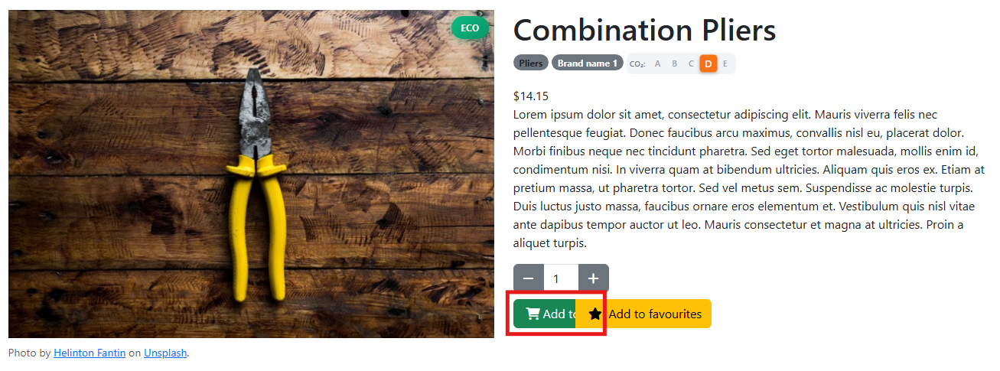

## 🐞 Bug #001 – “Add to cart” label not visible

**Environment:** Chrome / Windows 11  
**Severity:** Medium  
**Category:** Visual (UI)  
**Preconditions:** N/A  
**Date Found:** 5 November 2025  
**Reported by:** Ivonne Valenzuela  

**Steps to Reproduce:**
1. Go to https://with-bugs.practicesoftwaretesting.com/#/
2. Select any product from the catalogue.

**✅Expected Result:**    
The user should be able to clearly see the button labelled **“Add to cart”**.

**❌ Actual Result:**  
The **“Add to cart”** button label is not fully visible, it appears cropped or missing on the product detail page.

**📷 Evidence:**  

