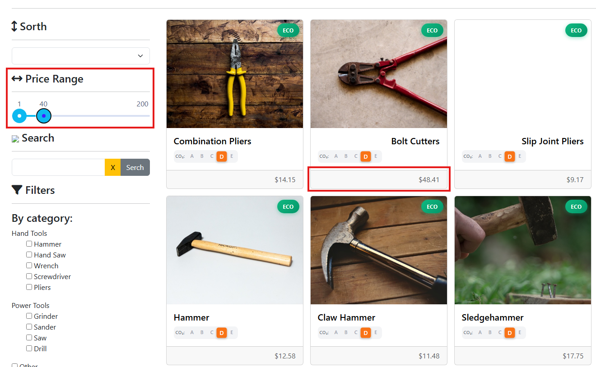
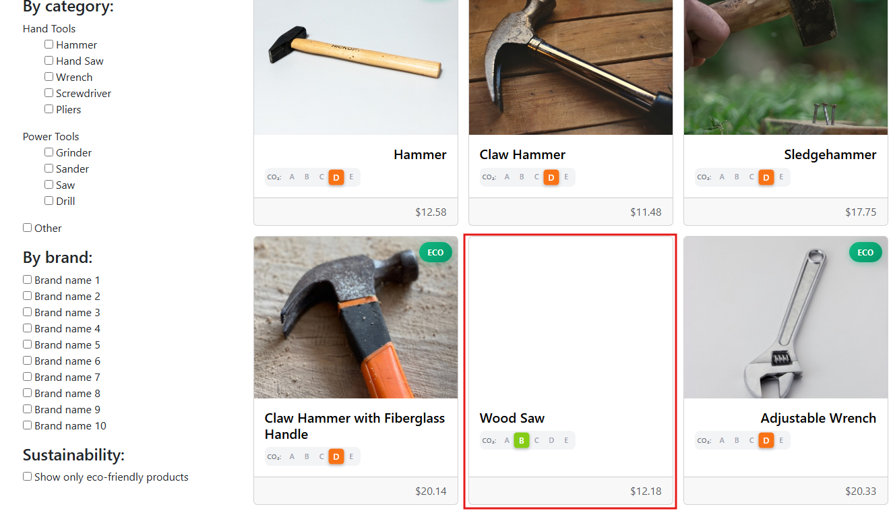
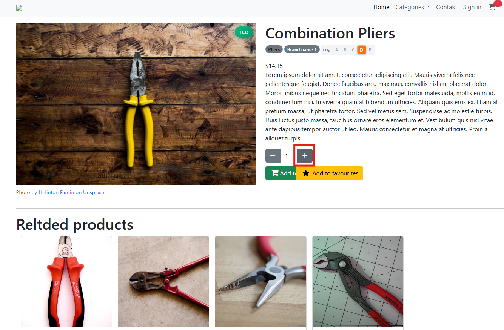
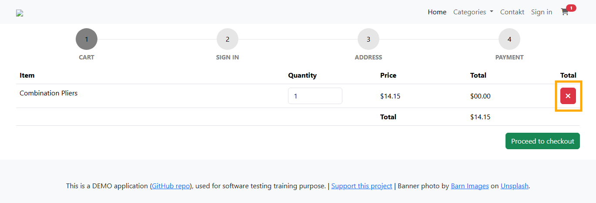
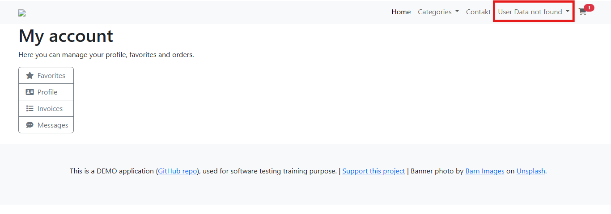
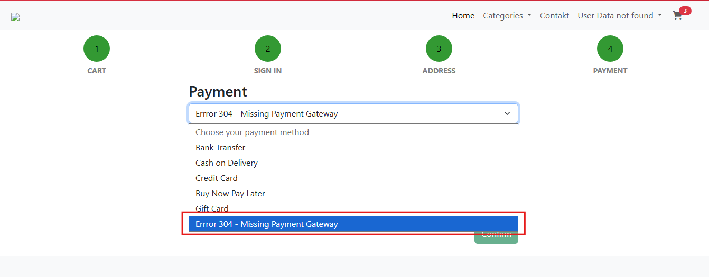
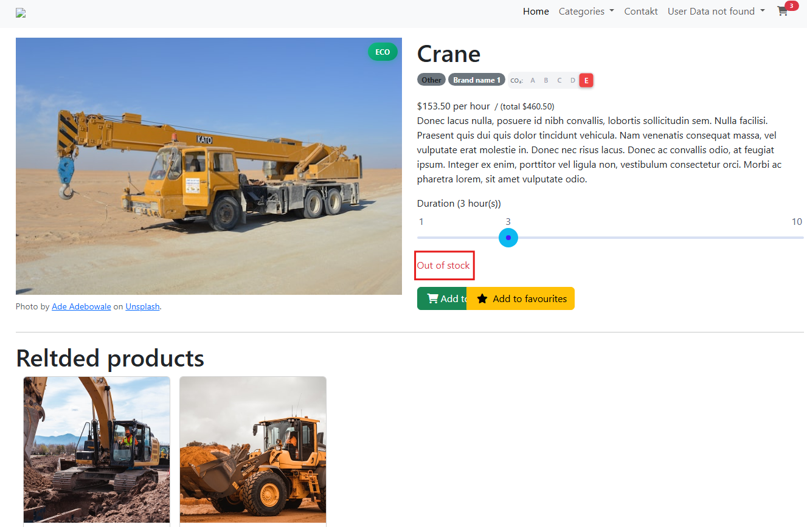
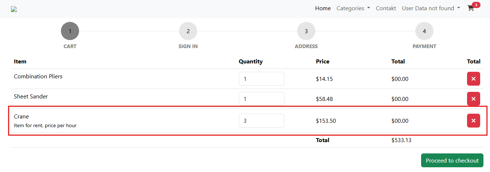
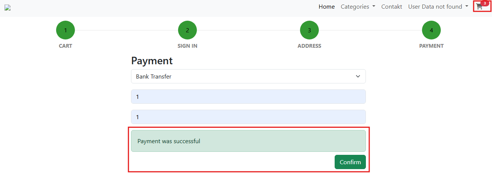

## 🐞 Bug #001 – “Add to cart” label not visible

**Environment:** Google Chrome 142.0 / Windows 11  
**Severity:** Medium  
**Category:** Visual (UI)  
**Preconditions:** N/A  
**Date Found:** 5 November 2025  
**Reported by:** Ivonne Valenzuela  

**Steps to Reproduce:**
1. Go to https://with-bugs.practicesoftwaretesting.com/#/
2. Select any product from the catalogue.

**✅Expected Result:**    
The user should be able to clearly see the button labelled **“Add to cart”**.

**❌ Actual Result:**  
The **“Add to cart”** button label is not fully visible, it appears cropped or missing on the product detail page.

**📷 Evidence:**  

---

## 🐞 Bug #002 – Price range filter not working correctly

**Environment:** Google Chrome 142.0 / Windows 11  
**Severity:** High  
**Category:** Functional  
**Preconditions:** N/A  
**Date Found:** 5 November 2025  
**Reported by:** Ivonne Valenzuela 

**Steps to Reproduce:**
1. Go to https://with-bugs.practicesoftwaretesting.com/#/.
2. On the left sidebar, locate the **Price Range** slider.
3. Set the price range to **$1 – $40**.
4. Observe the products displayed in the results grid.

**✅Expected Result:**    
Only products within the selected price range (between $1 and $40) should be displayed.

**❌ Actual Result:**  
The website displays items priced above the selected range.

**📷 Evidence:** 

---

## 🐞 Bug #003 – Some product images are missing in the catalogue view

**Environment:** Google Chrome 142.0 / Windows 11  
**Severity:** Low
**Category:** Visual 
**Preconditions:** N/A  
**Date Found:** 5 November 2025  
**Reported by:** Ivonne Valenzuela 

**Steps to Reproduce:**
1. Go to https://with-bugs.practicesoftwaretesting.com/#/.
2. Scroll down to view the full list of products on the homepage or category pages.

**✅Expected Result:**   
All products should display a visible image thumbnail before being opened.

**❌ Actual Result:**  
Some products appear without an image in the product grid, although an image is displayed once the product detail page is opened.

**📷 Evidence:** 

---

## 🐞 Bug #004 – Quantity increment button (“+”) not working correctly

**Environment:** Google Chrome 142.0 / Windows 11  
**Severity:** Medium 
**Category:** Functional (UI Interaction)  
**Preconditions:** N/A  
**Date Found:** 5 November 2025  
**Reported by:** Ivonne Valenzuela 

**Steps to Reproduce:**
1. Go to https://with-bugs.practicesoftwaretesting.com/#/.
2. Select any product from the catalogue (e.g. *Combination Pliers*).
3. Click the **“+”** button beside the quantity field. 

**✅Expected Result:**    
The quantity value should increase.

**❌ Actual Result:**  
The **“+”** button is visible but unresponsive, it does not increment the quantity value as expected.

**📷 Evidence:** 

---

## 🐞 Bug #005 – Remove item button (“X”) not working correctly

**Environment:** Google Chrome 142.0 / Windows 11  
**Severity:** High 
**Category:** Functional (UI Interaction)  
**Preconditions:** At least one item must be added to the cart.    
**Date Found:** 5 November 2025  
**Reported by:** Ivonne Valenzuela 

**Steps to Reproduce:**
1. Go to https://with-bugs.practicesoftwaretesting.com/#/.
2. Select any product from the catalogue.
3. Add product to shopping cart.
4. Go to the **Cart** page.
5. Click the **“X”** button to remove the item.

**✅Expected Result:**    
The selected item should be successfully removed from the cart, and the total should update accordingly. 

**❌ Actual Result:**  
The **“X”** button is visible but unresponsive, clicking it does not remove the item from the cart.

**📷 Evidence:** 

---

## 🐞 Bug #006 – User name not displayed after login

**Environment:** Google Chrome 142.0 / Windows 11  
**Severity:** High 
**Category:** Functional / Visual  
**Preconditions:** User account must exist and be logged in successfully.     
**Date Found:** 5 November 2025  
**Reported by:** Ivonne Valenzuela 

**Steps to Reproduce:**
1. Go to https://with-bugs.practicesoftwaretesting.com/#/.
2. Click the Sign in button.
3. Enter valid credentials in the login fields.
4. Observe the top-right section of the page after login.  

**✅Expected Result:**    
User’s name should be displayed at the top-right corner of the page

**❌ Actual Result:**  
Instead of displaying the user’s name, the message **“User Data not found”** appears at the top right corner of the page.  

**📷 Evidence:** 

---

## 🐞 Bug #007 – Incorrect payment option displayed (“Errror 304 – Missing Payment Gateway”)

**Environment:** Google Chrome 142.0 / Windows 11  
**Severity:** Medium
**Category:** Functional / Content  
**Preconditions:** User must be logged in and have items in the cart.
**Date Found:** 5 November 2025  
**Reported by:** Ivonne Valenzuela 

**Steps to Reproduce:**
1. Go to https://with-bugs.practicesoftwaretesting.com/#/.
2. Log in with valid credentials. 
3. Add one or more items to the shopping cart.
4. Proceed to checkout until reaching the **Payment** step.
5. Open the **Payment Method** dropdown list.

**✅Expected Result:**    
The dropdown should display only valid and relevant payment options.

**❌ Actual Result:**  
An invalid option appears in the dropdown **“Errror 304 – Missing Payment Gateway”**, which includes a spelling error.

**📷 Evidence:** 

 

---

## 🐞 Bug #008 – “Out of stock” items can still be added to cart.  

**Environment:** Google Chrome 142.0 / Windows 11  
**Severity:** High 
**Category:**   Functional
**Preconditions:** User must be logged in.    
**Date Found:** 5 November 2025  
**Reported by:** Ivonne Valenzuela 

**Steps to Reproduce:**
1. Go to https://with-bugs.practicesoftwaretesting.com/#/.
2. Log in with valid credentials.
3. Navigate to the product Crane, which is displayed as “Out of stock”.
4. Click the Add to cart button.
5. Proceed to the cart page.

**✅Expected Result:**    
The **Add to cart** button should be disabled or hidden when a product is **out of stock**, preventing users from adding unavailable items to the cart.

**❌ Actual Result:**  
The **Add to cart** button remains active, allowing the user to add an **out-of-stock** product (Crane) to the cart.

**📷 Evidence:** 

 
 

---

## 🐞 Bug #009 – Payment confirmation not completing checkout process

**Environment:** Google Chrome 142.0 / Windows 11  
**Severity:** High  
**Category:** Functional (Checkout Flow)  
**Preconditions:** At least one item added to the shopping cart.  
**Date Found:** 6 November 2025  
**Reported by:** Ivonne Valenzuela  

**Steps to Reproduce:**
1. Go to [https://www.practicesoftwaretesting.com/](https://www.practicesoftwaretesting.com/).  
2. Add any product to the shopping cart.  
3. Proceed to checkout and fill in the address form.  
4. On the **Payment** page, select **Bank Transfer** and click **Confirm**.  

**✅Expected Result:**  
After a successful payment, the user should be redirected to an order confirmation page.  
The shopping cart should be emptied, and a confirmation message or order ID should be displayed.  

**❌ Actual Result:**  
The message **“Payment was successful”** appears, however:  
- The user remains on the same page.  
- The cart still contains all items.  
- No confirmation or order number is generated.  

**📷 Evidence:** 

 

---

## 🐞 Bug #010 – Undefined category displayed in the “Categories” dropdown

**Environment:** Google Chrome 142.0 / Windows 11  
**Severity:** Medium
**Category:** Functional / Content 
**Preconditions:** N/A
**Date Found:** 6 November 2025  
**Reported by:** Ivonne Valenzuela  

**Steps to Reproduce:**
1. Go to [https://www.practicesoftwaretesting.com/](https://www.practicesoftwaretesting.com/).  
2. Open the **Categories** dropdown menu in the navigation bar.  
3. Select the option **Undefined**.   

**✅Expected Result:**  
Only valid and defined categories should appear in the dropdown.  
The system should not display an empty page or an “Undefined” option.  

**❌ Actual Result:**  
An invalid category **“Undefined”** appears in the dropdown list, and selecting it leads to a blank page without products. 

**📷 Evidence:** 

 

